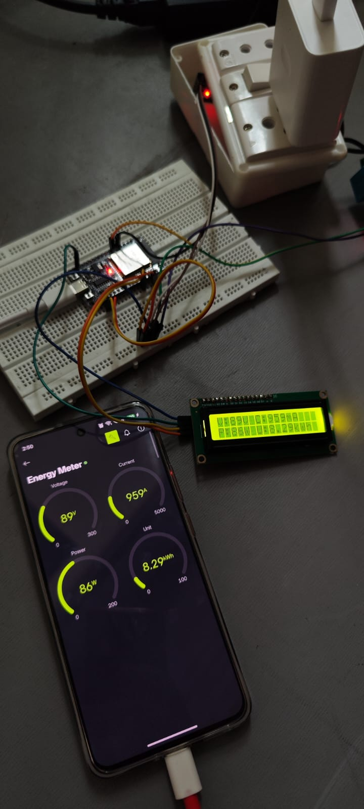

# ⚡ AI-Enabled IoT Smart Energy Meter

> ### An ESP32-powered smart energy meter with live LCD and Blynk monitoring—built as a foundation for predictive energy analytics.

**⚡ Measure electrical parameters &nbsp;|&nbsp; 📱 Monitor remotely &nbsp;|&nbsp; 📊 Build toward energy forecasting**



*Live prototype: ESP32, 16×2 LCD, connected load, and Blynk dashboard displaying Voltage, Current, Power, and Unit.*

## ✨ Key Features

- **ESP32-based sensing** for voltage and current measurements
- **Three live interfaces:** LCD, Serial Monitor, and Blynk dashboard
- **Remote monitoring** of Voltage, Current, Power, and cumulative Energy Unit
- **EEPROM-backed storage** to preserve accumulated energy after restart
- **Data-first AI roadmap:** calibrated logging followed by next-day energy forecasting
## Hardware
| Component | Purpose |
| --- | --- |
| ESP32 | Controller, Wi-Fi connectivity, and analog acquisition |
| ACS712 | Current sensing |
| ZMPT101B | Isolated AC voltage sensing |
| 16x2 I2C LCD | Local display |
| Blynk Cloud | Remote dashboard |

## 🔧 Hardware Documentation

Each component has its own detailed page:

- [ESP32 Development Board](hardware/ESP32.md)
- [ZMPT101B AC Voltage Sensor](hardware/ZMPT101B.md)
- [ACS712 Current Sensor](hardware/ACS712.md)
- [16×2 I2C LCD](hardware/LCD_16x2_I2C.md)
- [AC Socket and Load](hardware/AC_Socket_and_Load.md)

## 💻 Software and IoT

The ESP32 firmware is developed in Arduino IDE and uses the ESP32 Board Package, ACS712, ZMPT101B, LiquidCrystal_I2C, Blynk, WiFi, and EEPROM libraries.

Each software component has its own detailed page:

- [Arduino IDE](software/Arduino_IDE.md)
- [ESP32 Board Package](software/ESP32_Board_Package.md)
- [Arduino Libraries](software/Arduino_Libraries.md)
- [Blynk IoT Platform](software/Blynk_IoT_Platform.md)
## System architecture
```text
AC load → ACS712 + ZMPT101B → ESP32 → LCD / Serial Monitor / Blynk Dashboard
```

See the detailed [System Architecture](architecture/System_Architecture.md) page for the diagram, data flow, Blynk mapping, and prototype Serial Monitor readings.
## Project status
| Capability | Status |
| --- | --- |
| ESP32 sensor acquisition | Demonstrated |
| LCD and Serial Monitor output | Demonstrated |
| Blynk dashboard | Demonstrated |
| Energy calibration | In progress |
| Timestamped data logging and forecasting | Planned |
## Important measurement note
Energy integration must use elapsed time: `energy_kWh += power_W × elapsed_seconds / 3,600,000`.

Before using logged values for analysis, compare voltage, current, and energy against a trusted reference meter across several loads. This educational prototype is not a certified billing meter.
## Safety
This project involves mains-related sensing. Do not use a breadboard, jumper wires, or exposed terminals as a permanent AC installation. Use suitable isolation, fusing, enclosure, strain relief, and qualified supervision. The ESP32 must receive only low-voltage sensor outputs.
## 📄 Project Reports

The project documentation records the prototype design, ESP32 implementation, Blynk monitoring, preliminary measurements, and the planned predictive-energy-analysis path.

| Report | Format | Description |
| --- | --- | --- |
| [ESP32 IoT Smart Energy Meter Research Paper](reports/ESP32_IoT_Smart_Energy_Meter_Research_Paper.pdf) | PDF | Formal project research paper and implementation overview |
| [Prototype Research Report](output/pdf/Smart_Energy_Meter_Prototype_Research_Report.pdf) | PDF | Working-prototype evidence, measurements, calibration notes, and future roadmap |
| [Preliminary Review](output/pdf/Smart_Energy_Meter_Preliminary_Review.pdf) | PDF | Initial project review document |
| [Research Paper Source](AI_Enabled_IoT_Smart_Energy_Meter_Research_Paper.docx) | DOCX | Editable research-paper document |
## Team
Shayna Singh · Rupali Patel · Bhavya Sharma  
VIT Bhopal University
