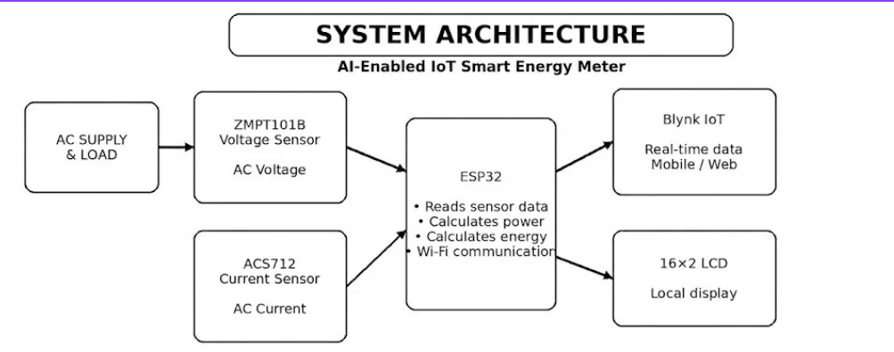

# 🏗️ System Architecture

## AI-Enabled IoT Smart Energy Meter



*Architecture of the ESP32-based energy-meter prototype.*

## Overview

The system measures voltage and current from a connected AC load, processes those sensor signals using an ESP32, and presents the results both locally and remotely. The ESP32 is the central controller: it reads the sensors, estimates power and energy, updates the LCD, and sends live values through Wi-Fi to Blynk IoT.

## Data flow

```text
AC Supply and Load
        │
        ├── ZMPT101B Voltage Sensor ──┐
        │                              │
        └── ACS712 Current Sensor ─────┼── ESP32
                                       │     │
                                       │     ├── 16×2 LCD: local readings
                                       │     ├── Serial Monitor: development readings
                                       │     └── Wi-Fi → Blynk IoT: mobile/web dashboard
                                       │
                                       └── EEPROM: stored energy value
```

## Component responsibilities

| System block | Responsibility |
| --- | --- |
| AC supply and load | Provides the electrical load being monitored |
| ZMPT101B | Produces the low-voltage signal used to estimate AC voltage |
| ACS712 | Produces the analog signal used to estimate load current |
| ESP32 | Reads sensors, calculates estimated power/energy, updates outputs, and connects to Wi-Fi |
| 16×2 LCD | Displays local Voltage, Current, Power, and Unit readings |
| Blynk IoT | Shows live values through a mobile or web dashboard |
| EEPROM | Retains the accumulated energy value across restarts |

## Dashboard mapping

| Blynk virtual pin | Value sent by ESP32 | Unit |
| --- | --- | --- |
| V0 | Voltage | V |
| V1 | Current | mA |
| V2 | Power | W |
| V3 | Energy Unit | kWh |

## Prototype measurement evidence

The following values were visible in the Serial Monitor during the working prototype demonstration.

| Sample | Voltage | Current | Power | Displayed Unit |
| --- | ---: | ---: | ---: | ---: |
| 1 | 89 V | 977 mA | 87 W | 8.2633 kWh |
| 2 | 89 V | 959 mA | 86 W | 8.2873 kWh |
| 3 | 91 V | 975 mA | 88 W | 8.3119 kWh |
| 4 | 90 V | 976 mA | 88 W | 8.3365 kWh |

These samples demonstrate that values travel through the sensing, ESP32 processing, and display/dashboard pipeline. They are preliminary prototype readings, not certified measurements. Voltage/current calibration and time-based energy integration must be verified against a trusted reference meter before the data is used for forecasting or billing-related claims.

## Future analytics path

After calibration, the ESP32 can log timestamped readings. Those readings can be grouped into daily energy-use data and used to compare a simple baseline forecast with a machine-learning model for next-day consumption prediction.
