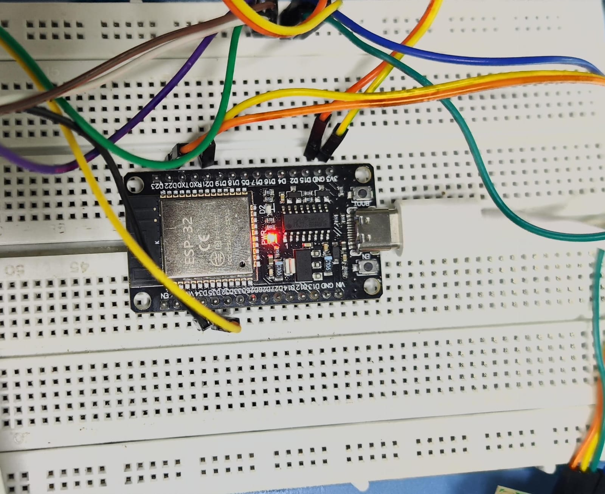

# ESP32 Development Board

*ESP32 development board used in the smart energy meter prototype.*

## 1. Overview

The ESP32 is the main microcontroller used in this project. 
It is responsible for collecting sensor data, processing the data,
and communicating with the IoT platform.

## 2. Why ESP32?

I selected ESP32 because it provides:

- Wi-Fi connectivity
- Bluetooth connectivity
- Multiple GPIO pins
- Analog input pins
- Good processing capability
- Compatibility with Arduino IDE
- Suitable for IoT applications

## 3. Specifications

| Feature | Details |
|---|---|
| Microcontroller | ESP32 |
| Wi-Fi | 2.4 GHz |
| Bluetooth | Bluetooth / BLE |
| Operating Voltage | 3.3V |
| GPIO | Multiple GPIO pins |
| ADC | 12-bit ADC |
| Programming | Arduino IDE |
| Communication | UART, I2C, SPI |

## 4. Role in My Project

The ESP32 will act as the main controller of the
AI-Enabled IoT Smart Energy Meter.

It will:

1. Receive voltage data from the voltage sensor.
2. Receive current data from the current sensor.
3. Calculate electrical parameters.
4. Display the measured values on the LCD.
5. Send data to the IoT platform through Wi-Fi.
6. Support future AI-based energy analysis.

## 5. Connections

### Planned Connections

| ESP32 | Component | Purpose |
|---|---|---|
| GPIO | Voltage Sensor | Voltage measurement |
| GPIO | Current Sensor | Current measurement |
| I2C | 16x2 LCD | Display |
| Wi-Fi | IoT Platform | Remote monitoring |

> Pin numbers will be updated after the circuit is finalized.

## 6. Development Environment

- Arduino IDE
- ESP32 Board Package
- USB Cable

## 7. Current Status

- [x] ESP32 purchased
- [x] ESP32 detected by computer
- [x] Arduino IDE installed
- [ ] Basic LED test
- [ ] Wi-Fi test
- [ ] Sensor interfacing
- [ ] Complete energy meter integration

